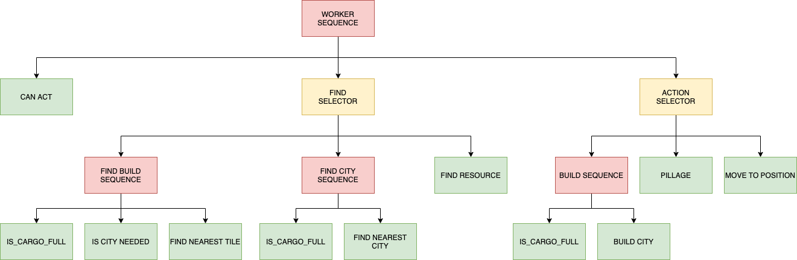
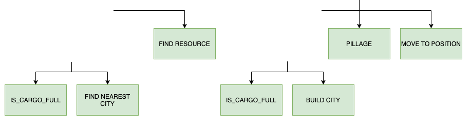
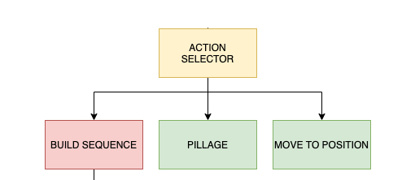
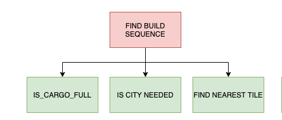
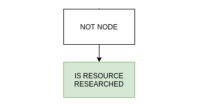

# What's a behaviour tree?

A behaviour tree is a model of a plan execution. They describe a series of tasks performed under rules. One main advantage is that the behaviour can be very complex only by using simple tasks, and another one is that the behaviour is completely predictable given the stage of rules already set.

For instance we can define the logic of an unit worker for the game as follows:




# How to build a behavior tree

### Task Nodes

These nodes are the leaf nodes and it is where the logic of our model is implemented. This nodes does not have any control over the flow from any state of the model to another but just accions are finally executed. This tasks can return either `True` if the acction has been executed successfully or `False` otherwise.



## Control Nodes

There are nodes in the tree called _control flow nodes_. This nodes is where the flow of states are defined. They are made by using a tree structure of two kind of nodes

### Selector node

A selector is used to find and execute the first child that does not fail. The children are executed in order from left to right. Basically, a selector selects one task or procedure in order from left to right until one is a success. If every node fails then the tree will no pick any task to perform. It returns `True` if ANY of its chiildren node return `True` else it returns `False`.


<p align="center">
  
</p>

In this selector which you'll find in the action that the worker will do:

- First it will try to build a city (using a sequence of Tasks explained in the example bellow).
- If if fails to build it will try to pillage.
- If it fails too, it will try to move, and if it fails too, the Selector will return `False`(otherwise `True`).

### Sequence node

Sequence nodes are used to find and execute the first child that has not yet succeeded. The children are executed in order from left to right. The difference in behaviour with the selector is that one fails no other task from the sequence is performed. It returns `True` if ALL of its children node return `True` else it returns `False`.

<p align="center">
  
</p>

In this sequence the actions will be performed as follows:

- First it will check if the cargo of the unit has space left and if it is full, the sequence ends and returns `False`
- If it continues, it willk check if a city is needd to be build and if it returns `True` the sequence will continue.
- With the to previous nodes have been succeded, the last node will try to build a city. If it succeded, the Sequence will return `True` (otherwise `False`).

## Decorador nodes

Other kind of nodes are the decorator nodes. These nodes has only one child and are used to modity the output or the execution of its son. In the project we only use an inverter node, which changes the output of the son node from `True` to `False` and `False` into `True`.

<p align="center">
  
</p>

This decorator changes the output of its son. If the resourced have been researched, it will the output from `True` to `False` and the otherway arround.

## Blackboard

The nodes are used to execute the actions of the state machine and does not output any result to another note. However we might need to store states in a memory handler to reuse and share information from one node to another. This is made through a memento object called Blackboard.


# Create your own behavior trees


### BH_Trees module

All the objects required for building a behavior tree are in teh directory `bh_trees`. There we have the following classes:

```
bh_trees/
  ├── __init__.py
  ├── nodes
  │    ├── class Sequence()
  │    ├── class Selector()
  │    ├── class Inverter()
  │    └── class Task()
  ├── tools.py
  │    └── def recursive_build()
  └── blackboard.py
       └── class BlackBoard()
```

* **Sequence**, **Selector**, **Inverter**: These are the structural and decorator nodes used by the tree.
* **Task**: The task node is used as a parent class to all the custom tasks defined from the project. It has a method `run()` where all the children nodes are executed and a blackboard attribute
* **BlackBoard**: This class is used to store the state of the tree. It is a singleton class so all the nodes share the same instante to read and uptade the information


### Create a Task

To create a custom task we have to create a new class that inherit from the Task class. The new class has to respect the `run()` function from Task and the atributte with the blackboard. For instance a node can be programmed as follows

```python
from bh_trees import Task


class BuildCityTile(Task):

    def __init__(self):
        super (BuildCityTile, self).__init__()

    def run(self):
        object = self._blackboard.get_value('object')
        game_map = self._blackboard.get_value('map')

        # Condition if it can build
        if object.can_build(game_map):
            build = object.build_city()
            self._blackboard.append_values(actions=build)
            return True
        return False

```

## Create a graph

To create a behavior tree graph we have to define it as a nested dict. For instance, the worker tree graph can be defined as


```python
graph = {
    Sequence(): {
        Sequence(): {
            CanAct(): {}
            },
        Selector(): { # Action selector of the example
            BuildWorker(): {},
            Sequence(): { # Research sequence of the example
                Inverter(): {
                    IsResourceResearched(): {}
                    },
                Research(): {}
                }
            }
        }
    }
```

once the graph variable is defined, we can build de graph using the following function

```python
from bh_trees import recursive_build

worker_bh_tree = recursive_build(graph)
```


### Create the Blackboard

Before running the tree we have to instanciate the BlackBoard class

```python
blackboard = set_values(actions = [],
                        id = self._id,
                        map = self._map,
                        turn = self._turn,
                        width = self._width,
                        height = self._height,
                        player = self._player,
                        n_units = self._n_units,
                        units_map = self._units_map
                        )

```

The task nodes can access this class for reading, writting and append new data.


[To know more here's Wikipedia](https://en.wikipedia.org/wiki/Behavior_tree_(artificial_intelligence,_robotics_and_control)).
